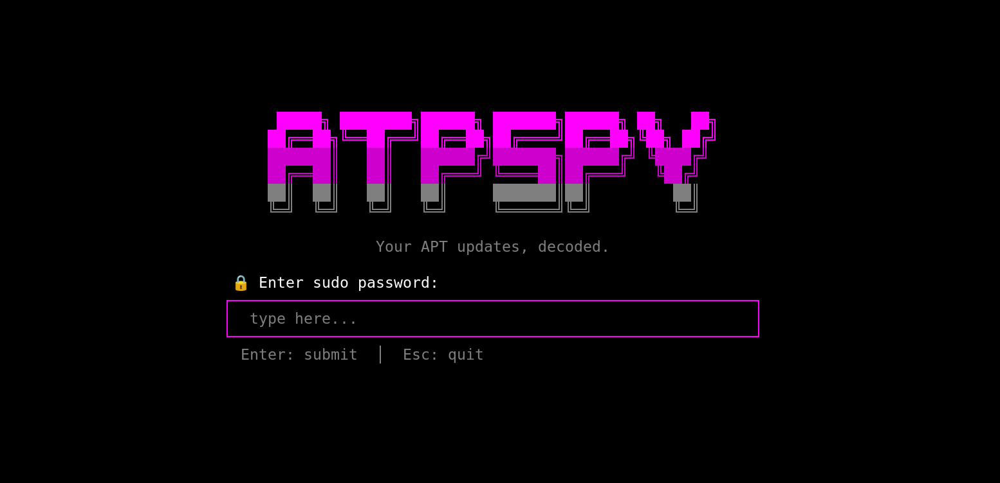

<p align="center">
  
</p>

<h3 align="center">🔍 Your APT updates, decoded.</h3>

<p align="center">
  A terminal UI (TUI) tool that gives you full visibility into your <code>apt</code> package updates — what you're updating, how critical it is, and lets you selectively upgrade with confidence.
</p>

<p align="center">
  
  
  
  
</p>

---

## 🤔 Why ATPspy?

We all run `sudo apt update && sudo apt upgrade -y` blindly. But do you know:

- Is `linux-image` getting updated? (**kernel change = reboot needed**)
- Is `libc6` being upgraded? (**core system library — high risk**)
- Is it just `vim` getting a patch? (**low risk, go ahead**)

**ATPspy** gives you a TUI dashboard to **see, analyze, and selectively upgrade** packages — no more blind updates.

## ✨ Features

| Feature | Status |
|---------|--------|
| 🔒 Secure password input inside TUI | ✅ Done |
| 🔄 Real `sudo apt update` with live scanning | ✅ Done |
| 📦 Parse `apt list --upgradable` | ✅ Done |
| 🔴🟡🟢 Risk-level color coding (Critical/High/Medium/Low) | ✅ Done |
| ✅ Select/deselect individual packages (Spacebar) | ✅ Done |
| 🅰️ Bulk select all / deselect all | ✅ Done |
| 🔄 Real `sudo apt install` for upgrades | ✅ Done |
| 📈 Upgrade progress tracking | ✅ Done |
| 📝 Live upgrade log viewer | ✅ Done |
| ❌ Wrong password detection & retry | ✅ Done |
| 🕐 Sudo timeout protection (30s) | ✅ Done |
| 🧪 Development mode with mock data | ✅ Done |

## 🎬 Workflow

```
┌─────────────┐     ┌─────────────┐     ┌─────────────┐     ┌─────────────┐
│  🔒 Password │ ──▶ │  🔄 Scanning │ ──▶ │  📦 Package  │ ──▶ │  📈 Upgrade  │
│    Screen    │     │   apt update │     │    List      │     │   Progress  │
└─────────────┘     └─────────────┘     └─────────────┘     └─────────────┘
       ▲                   │                                        │
       └───── ❌ Wrong ────┘                                        │
              Password                          ◀── Enter ──────────┘
```

1. **Password Screen** — Enter your sudo password (masked input)
2. **Scanning Screen** — Runs `sudo apt update` in background with spinner animation
3. **Package List** — Browse upgradable packages with risk indicators, select what to upgrade
4. **Upgrade Screen** — Real-time `sudo apt install` progress with live logs

## 🚀 Quick Start

### Prerequisites
- **Linux** with `apt` package manager (Debian/Ubuntu)
- **Rust** 1.75+ ([install](https://rustup.rs/))

### Build & Run

```bash
git clone https://github.com/Parashar-dev/ATPspy.git
cd ATPspy
cargo build --release
cargo run
```

### Development Mode (Mock Data)

Create a `.env` file in the project root:

```env
APP_MODE=development
```

This uses test data from `src/test/mockData/upgradable.txt` instead of real apt commands — perfect for UI development without sudo.

## 🎮 Keybinds

### Password Screen

| Key | Action |
|-----|--------|
| `Type` | Enter password characters |
| `Backspace` | Delete last character |
| `Enter` | Submit password & start scan |
| `Esc` | Quit |

### Package List Screen

| Key | Action |
|-----|--------|
| `↑` / `k` | Navigate up |
| `↓` / `j` | Navigate down |
| `Space` | Toggle select/deselect package |
| `a` | Select all packages |
| `d` | Deselect all packages |
| `u` | Start upgrading selected packages |
| `Esc` / `q` | Quit |

### Upgrade Screen

| Key | Action |
|-----|--------|
| `Enter` | Return to package list (after completion) |
| `Esc` | Quit |

## 🛡️ Risk Levels

ATPspy automatically categorizes packages by risk level:

| Color | Level | Examples | Why? |
|-------|-------|----------|------|
| 🔴 | **Critical** | `linux-image`, `libc6`, `grub-pc`, `grub-efi` | Kernel/bootloader — reboot required |
| 🟠 | **High** | `systemd`, `dbus`, `libssl` | Core system services |
| 🟡 | **Medium** | `python3.*`, security repo packages | Runtime/security updates |
| 🟢 | **Low** | `vim`, `git`, `wget`, everything else | Safe to upgrade |

## 🏗️ Project Structure

```
ATPspy/
├── Cargo.toml
├── .env                          # APP_MODE=development|production
├── src/
│   ├── main.rs                   # Entry point, state machine, event loop
│   ├── models/
│   │   ├── mod.rs
│   │   └── package.rs            # Package struct, RiskLevel enum
│   ├── ui/
│   │   ├── mod.rs
│   │   ├── password_screen.rs    # 🔒 Password input with ASCII art
│   │   ├── list_screen.rs        # 📦 Package list with risk indicators
│   │   ├── scan_screen.rs        # 🔄 Scanning animation + logs
│   │   └── upgrad_screen.rs      # 📈 Upgrade progress + live logs
│   └── test/
│       └── mockData/
│           └── upgradable.txt    # Sample apt output for dev testing
└── assets/
    └── banner.png
```

## 🛠️ Tech Stack

- **Language:** Rust 🦀
- **TUI Framework:** [Ratatui](https://github.com/ratatui/ratatui)
- **Terminal Backend:** [Crossterm](https://github.com/crossterm-rs/crossterm)
- **Threading:** `std::thread` + `std::sync::mpsc` channels
- **Config:** [dotenvy](https://github.com/allan2/dotenvy)

## ⚠️ Security Note

ATPspy handles your sudo password in-memory only — it is **never written to disk or logged**. The password is passed directly to `sudo -S` via stdin pipe and cleared from memory on error.

## 🤝 Contributing

Contributions are welcome! Feel free to:

1. Fork the repo
2. Create a feature branch (`git checkout -b feature/awesome`)
3. Commit your changes (`git commit -m 'Add awesome feature'`)
4. Push to the branch (`git push origin feature/awesome`)
5. Open a Pull Request

## 📄 License

This project is licensed under the MIT License — see the [LICENSE](LICENSE) file for details.

---

<p align="center">
  Made with 🦀 and ☕ by <a href="https://github.com/Parashar-dev">Parashar</a>
</p>
